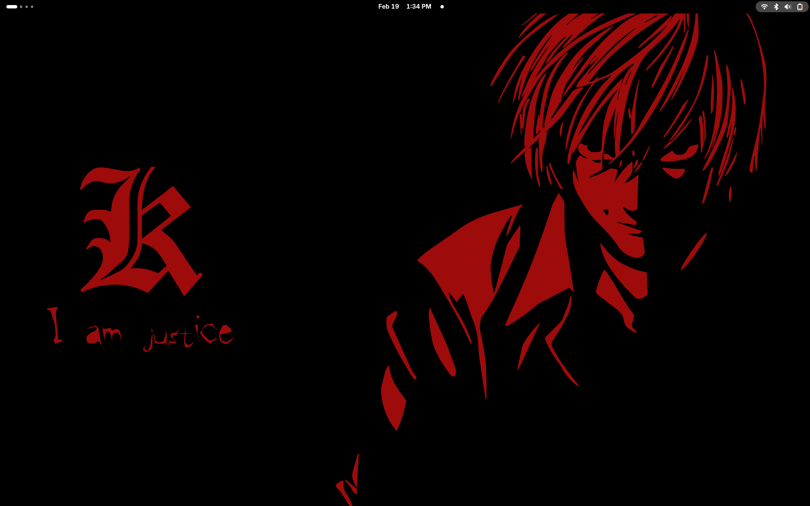
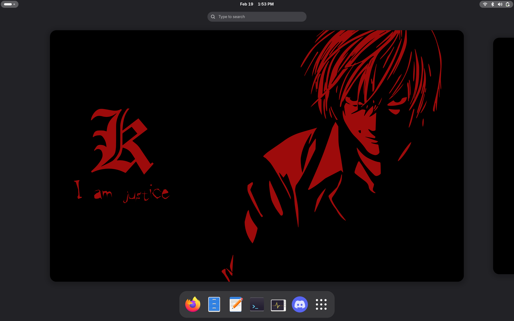
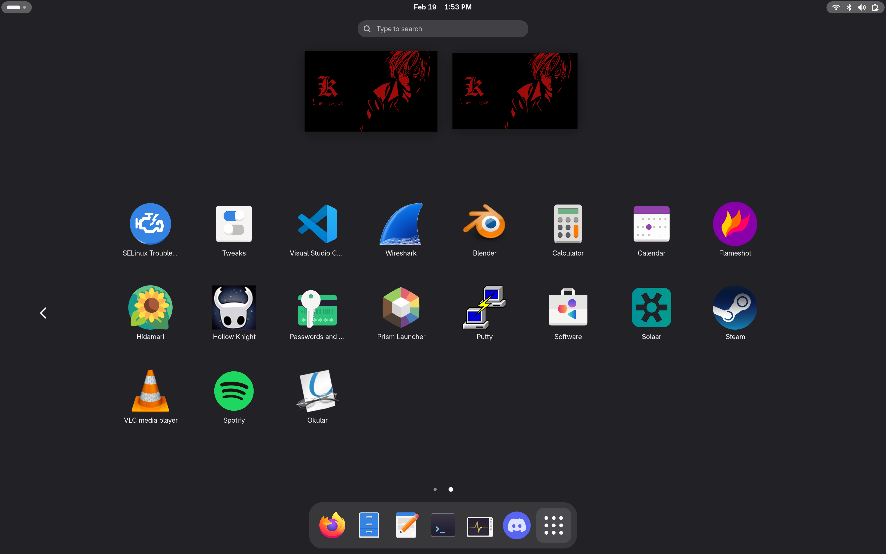
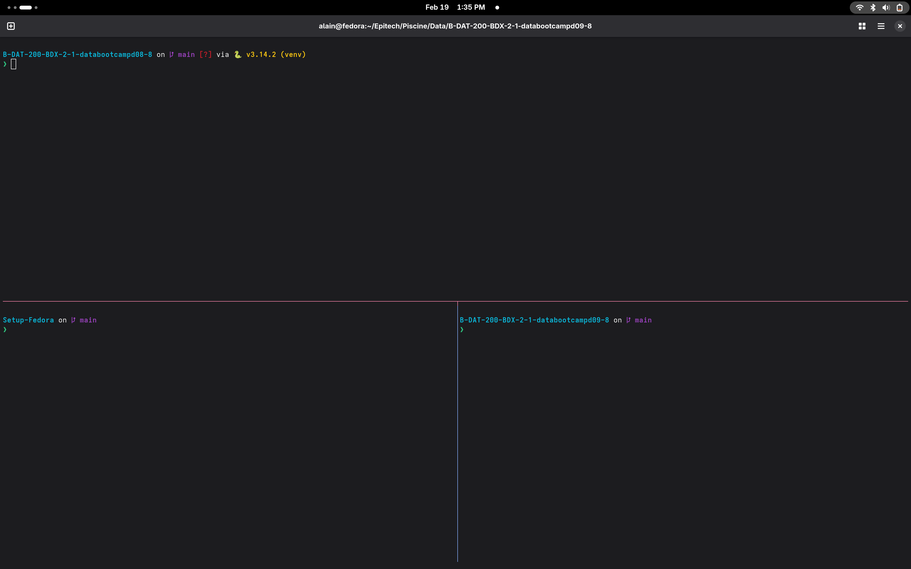
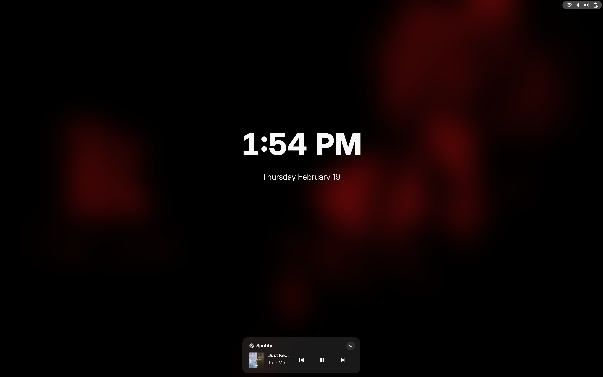
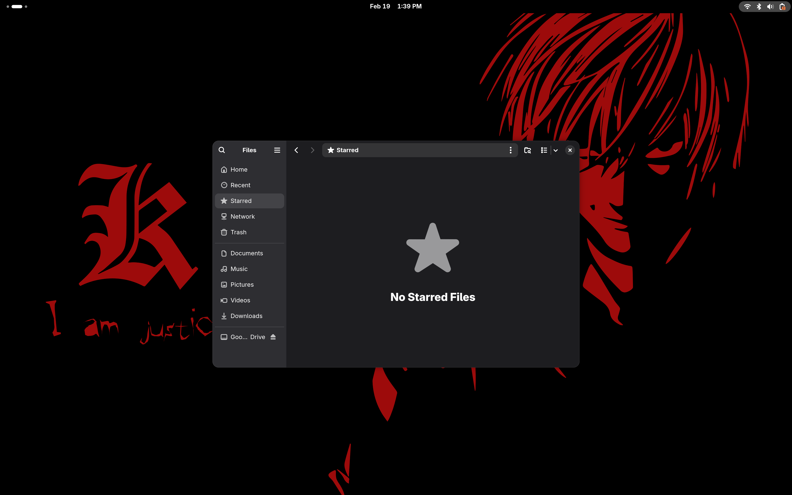

# Mon setup Fedora — Guide complet


---

## Aperçu

<h3 align="center">📸 Mon setup en action</h3>

<table>
  <tr>
    <td align="center"><br/><sub>Bureau</sub></td>
    <td align="center"><br/><sub>Bureau GNOME</sub></td>
    <td align="center"><br/><sub>Application</sub></td>
  </tr>
  <tr>
    <td align="center"><br/><sub>Terminal tmux</sub></td>
    <td align="center"><br/><sub>Lock-Screen with Face-ID</sub></td>
    <td align="center"><br/><sub>Google Drive</sub></td>
  </tr>
</table>

---

Ce guide regroupe tout ce que j'ai fait pour avoir un Fedora propre, optimisé et agréable à utiliser sur un ASUS ProArt P16 (AMD Ryzen 9 + RTX 4070). La majorité des étapes sont automatisées via le script `install.sh` fourni avec ce guide. Il suffit de le lancer et il fait tout tout seul. Il reste quelques petites choses à faire à la main après, elles sont listées à la fin.

---

## Installation automatique

Clone le repo :

```bash
git clone https://github.com/ton_user/fedora-setup.git
cd fedora-setup
```

Lance le script :

```bash
chmod +x install.sh
./install.sh
```

Le script installe et configure automatiquement tout ce qui suit. Tu peux quand même lire les sections ci-dessous pour comprendre ce qu'il fait.

---

## Ce que fait le script

### 1. Mise à jour système et RPM Fusion

Le script commence par mettre à jour le système et activer RPM Fusion pour avoir accès à beaucoup plus de paquets.

```bash
sudo dnf upgrade --refresh -y
sudo dnf install -y dnf-plugins-core

sudo dnf install -y https://mirrors.rpmfusion.org/free/fedora/rpmfusion-free-release-$(rpm -E %fedora).noarch.rpm
sudo dnf install -y https://mirrors.rpmfusion.org/nonfree/fedora/rpmfusion-nonfree-release-$(rpm -E %fedora).noarch.rpm
```

Accélère aussi DNF pour les prochaines installations :

```bash
echo 'max_parallel_downloads=10' | sudo tee -a /etc/dnf/dnf.conf
echo 'fastestmirror=True' | sudo tee -a /etc/dnf/dnf.conf
```

---

### 2. Drivers NVIDIA

Sur les laptops ASUS avec Secure Boot, les drivers NVIDIA ne se chargent pas tout seuls. Voilà comment régler ça.

```bash
sudo dnf install -y akmod-nvidia xorg-x11-drv-nvidia-cuda
```

Si après un reboot `nvidia-smi` ne fonctionne pas, le problème vient souvent du Dynamic Power Management qui éteint le GPU avant que le module se charge. Crée ce fichier :

```bash
sudo nano /etc/modprobe.d/nvidia.conf
```

```
options nvidia NVreg_DynamicPowerManagement=0x00
options nvidia NVreg_EnableGpuFirmware=0
options nvidia-drm modeset=1
```

```bash
sudo dracut --force
sudo reboot
```

Vérifie que tout fonctionne :

```bash
nvidia-smi
```

Tu devrais voir ta RTX avec la version du driver.

---

### 3. Terminal — Tmux

J'utilise le terminal GNOME par défaut avec tmux pour gérer plusieurs panneaux dans la même fenêtre.

```bash
sudo dnf install -y tmux
```

Ma config `~/.tmux.conf` :

```bash
nano ~/.tmux.conf
```

```
# Souris pour cliquer entre les panneaux
set -g mouse on

# Cacher la barre de statut
set -g status off

# Couleurs des bordures
set -g pane-border-style fg=#89b4fa
set -g pane-active-border-style fg=#f38ba8,bold

# Raccourcis
bind -n C-v split-window -h        # Nouveau panneau vertical
bind -n C-h split-window -v        # Nouveau panneau horizontal
bind -n C-w if-shell "[ $(tmux list-panes | wc -l) -gt 1 ]" "kill-pane" "display-message 'Impossible de fermer le dernier panneau!'"
```

Pour que tmux se lance automatiquement à l'ouverture du terminal, ajoute ça dans `~/.zshrc` :

```bash
if [ -z "$TMUX" ]; then
    tmux attach-session -t default 2>/dev/null || tmux new-session -s default
fi
```

---

### 4. Shell — Zsh + Oh My Zsh

```bash
sudo dnf install -y zsh
sh -c "$(curl -fsSL https://raw.githubusercontent.com/ohmyzsh/ohmyzsh/master/tools/install.sh)"
```

Installe les plugins essentiels :

```bash
git clone https://github.com/zsh-users/zsh-autosuggestions ${ZSH_CUSTOM:-~/.oh-my-zsh/custom}/plugins/zsh-autosuggestions

git clone https://github.com/zsh-users/zsh-syntax-highlighting ${ZSH_CUSTOM:-~/.oh-my-zsh/custom}/plugins/zsh-syntax-highlighting

git clone https://github.com/zsh-users/zsh-history-substring-search ${ZSH_CUSTOM:-~/.oh-my-zsh/custom}/plugins/zsh-history-substring-search
```

Dans `~/.zshrc`, trouve la ligne `plugins=(git)` et remplace par :

```
plugins=(git zsh-autosuggestions zsh-syntax-highlighting zsh-history-substring-search z sudo)
```

Ajoute aussi à la fin du fichier :

```bash
# Historique
HISTSIZE=10000
SAVEHIST=10000
setopt HIST_IGNORE_DUPS
setopt SHARE_HISTORY

# Flèches pour naviguer dans l'historique
bindkey '^[[A' history-substring-search-up
bindkey '^[[B' history-substring-search-down

# Flèche droite pour accepter la suggestion
bindkey '^[[C' autosuggest-accept
```

---

### 5. Raccourci clavier — Ouvrir un terminal

Pour ouvrir un terminal avec `Super+Entrée` :

```bash
dconf write /org/gnome/settings-daemon/plugins/media-keys/custom-keybindings/custom0/name "'Terminal'"
dconf write /org/gnome/settings-daemon/plugins/media-keys/custom-keybindings/custom0/command "'gnome-terminal'"
dconf write /org/gnome/settings-daemon/plugins/media-keys/custom-keybindings/custom0/binding "'<Super>Return'"
```

---

### 6. Rétroéclairage clavier

Sur le ProArt P16, le rétroéclairage est géré via `/sys/class/leds/asus::kbd_backlight`.

Pour qu'il s'allume au démarrage, crée une règle udev :

```bash
sudo nano /etc/udev/rules.d/99-kbd-backlight.rules
```

```
ACTION=="add", SUBSYSTEM=="leds", KERNEL=="asus::kbd_backlight", ATTR{brightness}="3", RUN+="/bin/chmod a+w /sys/class/leds/asus::kbd_backlight/brightness"
```

```bash
sudo udevadm control --reload-rules
sudo udevadm trigger
```

Pour toggler le rétroéclairage avec `F4`, crée ce script :

```bash
nano ~/toggle-kbd-backlight.sh
```

```bash
#!/bin/bash
MAX=$(cat /sys/class/leds/asus::kbd_backlight/max_brightness)
CURRENT=$(cat /sys/class/leds/asus::kbd_backlight/brightness)

if [ "$CURRENT" -eq 0 ]; then
    echo $MAX > /sys/class/leds/asus::kbd_backlight/brightness
else
    echo 0 > /sys/class/leds/asus::kbd_backlight/brightness
fi
```

```bash
chmod +x ~/toggle-kbd-backlight.sh
```

Puis dans **Paramètres → Clavier → Raccourcis personnalisés**, ajoute :
- Commande : `bash /home/ton_user/toggle-kbd-backlight.sh`
- Raccourci : `F4`

---

### 7. Google Drive avec rclone

```bash
sudo dnf install -y rclone
mkdir -p ~/GoogleDrive
rclone config  # Suis l'assistant, choisis Google Drive (option 24)
```

Pour monter le drive au démarrage :

```bash
mkdir -p ~/.config/autostart
nano ~/.config/autostart/rclone-gdrive.desktop
```

```
[Desktop Entry]
Type=Application
Name=Google Drive
Exec=bash -c "sleep 5 && rclone mount Google-Drive: /home/ton_user/GoogleDrive --daemon --vfs-cache-mode writes"
Hidden=false
NoDisplay=false
X-GNOME-Autostart-enabled=true
```

Le `sleep 5` laisse le temps au réseau de se connecter avant de monter le drive.

---

### 8. Luminosité au démarrage

Pour avoir l'écran à 100% de luminosité dès la connexion :

```bash
sudo dnf install -y brightnessctl
nano ~/.config/autostart/brightness.desktop
```

```
[Desktop Entry]
Type=Application
Name=Brightness
Exec=bash -c "sleep 2 && brightnessctl set 100%"
Hidden=false
NoDisplay=false
X-GNOME-Autostart-enabled=true
```

---

### 9. Applications installées

### Via DNF
```bash
sudo dnf install -y steam vlc firefox putty openvpn networkmanager-openvpn \
  java-21-openjdk nodejs npm python3 python3-pip \
  flameshot unrar p7zip p7zip-plugins solaar \
  wireshark nmap git ansible okular
```

### Via Flatpak
```bash
flatpak remote-add --if-not-exists flathub https://dl.flathub.org/repo/flathub.flatpakrepo

flatpak install flathub com.spotify.Client
flatpak install flathub com.discordapp.Discord
flatpak install flathub md.obsidian.Obsidian
flatpak install flathub com.jgraph.drawio
flatpak install flathub so.notion.Notion
flatpak install flathub org.balena.etcher
flatpak install flathub com.microsoft.Teams
flatpak install flathub com.visualstudio.code
```

### Via Snap
```bash
sudo dnf install -y snapd
sudo ln -s /var/lib/snapd/snap /snap
sudo snap wait system seed.loaded
```

### Raccourci Flameshot
Dans **Paramètres → Clavier → Raccourcis personnalisés** :
- Commande : `flameshot gui`
- Raccourci : `Impr écran`

---

### 10. Stack DevOps

```bash
# Docker
sudo dnf-3 config-manager --add-repo https://download.docker.com/linux/fedora/docker-ce.repo
sudo dnf install -y docker-ce docker-ce-cli containerd.io
sudo systemctl enable --now docker
sudo usermod -aG docker $USER

# Kubectl
curl -LO "https://dl.k8s.io/release/$(curl -sL https://dl.k8s.io/release/stable.txt)/bin/linux/amd64/kubectl"
sudo install -m 755 kubectl /usr/local/bin/

# Terraform
sudo dnf config-manager --add-repo https://rpm.releases.hashicorp.com/fedora/hashicorp.repo
sudo dnf install -y terraform

# Helm
curl https://raw.githubusercontent.com/helm/helm/main/scripts/get-helm-3 | bash
```

---

### 11. Outils réseau

```bash
sudo dnf install -y wireshark nmap netcat traceroute tcpdump \
  mtr bind-utils whois iperf3 wireguard-tools
sudo usermod -aG wireshark $USER
```

---

### 12. Reconnaissance faciale — Howdy

Howdy est un système de reconnaissance faciale style Windows Hello pour Linux. Il permet de déverrouiller la session GNOME avec ton visage.

```bash
# Dépendances
sudo dnf install -y cmake gcc gcc-c++ python3-devel meson ninja-build \
  python3-opencv python3-numpy inih-devel libevdev-devel pam-devel

# Installation dlib
pip3 install dlib --break-system-packages

# Cloner et compiler Howdy
git clone https://github.com/boltgolt/howdy ~/howdy
cd ~/howdy
sudo meson setup build
sudo ninja -C build install

# Télécharger les modèles dlib
sudo mkdir -p /usr/local/share/dlib-data
cd /usr/local/share/dlib-data
sudo curl -LO http://dlib.net/files/shape_predictor_5_face_landmarks.dat.bz2
sudo bzip2 -d shape_predictor_5_face_landmarks.dat.bz2
sudo curl -LO http://dlib.net/files/mmod_human_face_detector.dat.bz2
sudo bzip2 -d mmod_human_face_detector.dat.bz2
sudo curl -LO http://dlib.net/files/dlib_face_recognition_resnet_model_v1.dat.bz2
sudo bzip2 -d dlib_face_recognition_resnet_model_v1.dat.bz2

# Lien symbolique PAM
sudo ln -s /usr/local/lib64/security/pam_howdy.so /lib64/security/pam_howdy.so

# Autoriser howdy dans SELinux
sudo semanage permissive -a xdm_t
```

Configure la webcam (remplace `video0` si besoin) :
```bash
sudo howdy config
# Mets : device_path = /dev/video0
```

Enregistre ton visage :
```bash
sudo howdy add
```

Active dans PAM pour le déverrouillage GNOME :
```bash
sudo bash -c 'sed -i "1s/^/auth        sufficient    pam_howdy.so\n/" /etc/pam.d/gdm-password'
```

Commandes utiles :
```bash
sudo howdy test      # Tester la reconnaissance
sudo howdy list      # Voir les profils
sudo howdy add       # Ajouter un profil
sudo howdy remove ID # Supprimer un profil
```

---

### 13. Personnalisation GNOME

```bash
sudo dnf install -y gnome-tweaks
```

**Curseur style macOS :**
```bash
sudo dnf copr enable peterwu/rendezvous -y
sudo dnf install -y capitaine-cursors
gsettings set org.gnome.desktop.interface cursor-theme 'capitaine-cursors'
```

**Fond d'écran animé (optionnel) :**
```bash
flatpak install flathub io.github.jeffshee.Hidamari
sudo dnf install -y yt-dlp
yt-dlp -o ~/Videos/wallpaper.webm "URL_YOUTUBE"
# Puis ouvre Hidamari et sélectionne le fichier
```

---

---

## Ce qu'il faut faire à la main après le script

Le script fait l'essentiel, mais ces étapes ne peuvent pas être automatisées car elles nécessitent une interaction manuelle.

### 1. Rebooter

C'est la première chose à faire après le script pour que les drivers NVIDIA et les changements de groupe (docker, wireshark) prennent effet.

```bash
sudo reboot
```

### 2. Vérifier les drivers NVIDIA

Après le reboot :

```bash
nvidia-smi
```

Tu devrais voir ta RTX avec la version du driver. Si ce n'est pas le cas, relis la section drivers NVIDIA ci-dessus.

### 3. Configurer Google Drive

Le script crée le dossier et le fichier autostart, mais la connexion à ton compte Google doit se faire manuellement :

```bash
rclone config
```

Suis l'assistant interactif — choisis `n` pour nouveau remote, nomme-le `Google-Drive`, sélectionne l'option `24` (Google Drive), laisse client_id et client_secret vides, choisis le scope `1` (accès complet), et accepte l'authentification via le navigateur.

### 4. Raccourci F4 pour le rétroéclairage

Le script crée le fichier `toggle-kbd-backlight.sh` mais le raccourci doit être ajouté manuellement dans GNOME :

**Paramètres → Clavier → Raccourcis clavier → Raccourcis personnalisés → +**

- Nom : `Toggle Backlight`
- Commande : `bash /home/ton_user/toggle-kbd-backlight.sh`
- Raccourci : `F4`

### 5. Fond d'écran animé (optionnel)

Si tu veux un fond d'écran animé, Hidamari est déjà installé par le script. Il suffit de lui donner une vidéo :

```bash
sudo dnf install -y yt-dlp
yt-dlp -o ~/Videos/wallpaper.webm "URL_YOUTUBE"
```

Puis ouvre Hidamari depuis le menu des applis et sélectionne le fichier.

---

## Notes finales

Quelques trucs à garder en tête sur Fedora :

- **SELinux** est activé par défaut, ne le désactive pas. Utilise `setroubleshoot` pour déboguer si t'as des problèmes de permissions.
- **Firewalld** est actif, pense-y si tu testes des services réseau en local.
- Les **Flatpaks** sont isolés du système, c'est plus sécurisé mais parfois moins bien intégré.
- Sur les laptops ASUS, le module NVIDIA peut avoir besoin de quelques secondes après le boot pour être disponible.
- Le Google Drive est monté en streaming, les fichiers ne prennent pas de place sur le disque sauf si tu les copies localement.